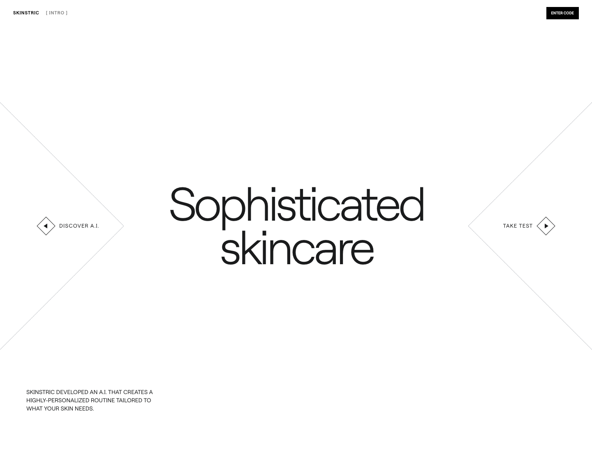

# Skinstric App

An interactive AI skincare analysis experience built as a multi-step product flow with image capture, upload, and demographic result views.

**Live demo:** [skinstric-app-tau.vercel.app](https://skinstric-app-tau.vercel.app)



---

## What It Does

Skinstric App guides users through a stylized analysis journey:

- Intro screen with animated diamond interactions and directional calls to action.
- Name and city onboarding form with validation and loading states.
- Camera capture and image upload paths.
- API-backed image analysis flow using the provided Skinstric cloud functions.
- Demographics selection screen for race, age, and gender estimates.
- Summary page with animated percentage visualization and editable category selections.
- Local storage handoff between steps for a smooth client-side experience.

---

## Tech Stack

- Next.js 16 App Router
- React 19
- TypeScript
- Tailwind CSS v4
- React Hooks
- Browser media APIs
- React Icons
- Fetch API
- Vercel for deployment

---

## CI/CD

- **CI** — GitHub Actions runs the Jest suite on every push and pull request (see the badge above).
- **CD** — Deployment is handled automatically by Vercel, which builds and ships every push to `main`. API configuration is stored as Vercel environment variables rather than committed to the repo.

---

## Run Locally

```bash
npm install
npm run dev
```

Then open [http://localhost:3000](http://localhost:3000).

---

## Project Status

This project focuses on high-polish interface motion, responsive layouts, and a guided AI-analysis flow. Future improvements could include authentication, persisted user history, and richer result explanations.
